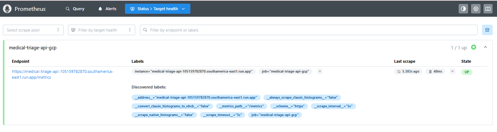
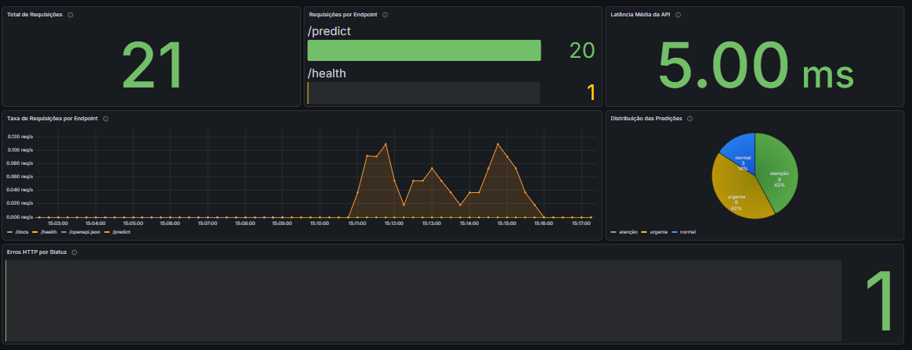

# Medical Triage MLOps — Triagem de Laudos Médicos


Sistema **MLOps de triagem automática de laudos médicos**: dado o texto de um laudo/abstract, o modelo classifica em **3 níveis de urgência** — `urgente`, `atenção`, `normal` — para priorizar a fila de atendimento.

O dataset original ([Medical Abstracts TC Corpus](https://github.com/sebischair/Medical-Abstracts-TC-Corpus)) possui categorias de doenças, e não níveis de urgência. A solução utiliza um **BioBERT pré-treinado** (`Yuvrajxms09/biobert-triage-classifier`, binário urgent/non-urgent) para gerar pseudo-rótulos para os abstracts.

Uma regra baseada em threshold cria a zona de incerteza `atenção`, e posteriormente um **modelo leve TF-IDF + Logistic Regression** é treinado sobre esses pseudo-rótulos.

O modelo escolhido para produção é o `logreg_tfidf_v2`, com aproximadamente **0,3 MB**, baixa latência de inferência e sem necessidade de `torch`, `transformers` ou GPU no serving.

> Projeto do **Tech Challenge Fase 3 — POSTECH (MLET)**. As decisões sobre dependências, ambientes, Docker e CI estão registradas em [docs/dependency-management.md](docs/dependency-management.md).

---

## Resultados

Avaliação no split de teste (1.685 amostras, 203 `urgente`). O baseline v1 foi treinado sobre uma amostra parcial e enviesada (720 abstracts); os modelos v2 utilizam o corpus completo pseudo-rotulado.

| Modelo | Accuracy | Balanced Acc | Macro F1 | Recall `urgente` | Tamanho | Latência média |
|---|---:|---:|---:|---:|---:|---:|
| MLP v1 (720 amostras) | 0,565 | 0,442 | 0,406 | 0,000 | 7,5 MB | 4,3 ms |
| MLP v2 (corpus completo) | **0,776** | 0,731 | **0,748** | 0,591 | 7,5 MB | 0,59 ms |
| **LogReg balanced v2** ✅ | 0,767 | **0,777** | **0,748** | **0,808** | **0,3 MB** | **0,46 ms** |

**Modelo escolhido para produção: `logreg_tfidf_v2`**

A escolha considera principalmente o desempenho na classe `urgente`, que representa a classe crítica do sistema de triagem. O modelo apresenta **recall de aproximadamente 81% para casos urgentes**, mantendo Macro F1 de 0,748 e utilizando `class_weight='balanced'`.

As métricas completas, incluindo métricas por classe, matriz de confusão, validação e teste estão disponíveis em:

[docs/results/test_metrics.json](docs/results/test_metrics.json)

---

## Arquitetura

```mermaid
flowchart LR

    subgraph OFFLINE["Offline — Batch"]
        A[("Medical Abstracts<br/>11.227 únicos")] --> B["BioBERT pré-treinado<br/>urgent / non-urgent"]
        B --> C["Regra threshold 0,70<br/>normal · atenção · urgente"]
        C --> D["Split estratificado<br/>70 / 15 / 15"]
        D --> E["TF-IDF + LogReg<br/>(class_weight=balanced)"]
    end

    subgraph ONLINE["Online — Real-time"]
        F["FastAPI<br/>/predict"] --> G["Container Docker"]
        G --> H["Google Cloud Run"]
        H --> I["/metrics"]
        I --> J["Prometheus"]
        J --> K["Grafana"]
    end

    E -->|"joblib"| F

    style B fill:#dbeafe,stroke:#2563eb
    style E fill:#dcfce7,stroke:#16a34a
    style F fill:#fef9c3,stroke:#ca8a04
    style J fill:#fee2e2,stroke:#dc2626
    style K fill:#ffedd5,stroke:#f97316
```



O fluxo possui duas partes principais:

- **Offline / Batch:** geração dos pseudo-rótulos, divisão dos dados e treinamento dos modelos.
- **Online / Real-time:** API FastAPI responsável por receber o laudo e realizar a classificação.

O modelo de produção é carregado uma única vez durante o startup da API e permanece em memória para atender às requisições.

A classe `atenção` **não é aprendida diretamente pelo BioBERT**. Ela representa uma regra operacional baseada na zona de incerteza do classificador binário:

`0,30 ≤ urgent_score < 0,70`

Essa decisão está documentada nos notebooks e nos artefatos de avaliação em `docs/results/`.

---

## Decisão arquitetural — Real-time vs Batch

O sistema foi projetado considerando dois tipos diferentes de processamento.

### Inferência — Real-time

A triagem de um laudo deve acontecer no momento em que o texto chega ao sistema. Por isso, a inferência é realizada através de uma **API REST em FastAPI**, empacotada em um container Docker.

A arquitetura de serving no Google Cloud utiliza:

```text
Cliente
   |
   v
Cloud Run
   |
   v
Container FastAPI
   |
   v
Modelo TF-IDF + Logistic Regression
```

Os principais serviços utilizados/planejados são:

```text
Google Cloud
   |
   +--> Artifact Registry
   |     Imagem da API
   |
   +--> Cloud Run
   |     Serving HTTP
   |
   +--> Cloud Storage
   |     Remote do DVC
   |
   +--> Cloud Composer
         Orquestração Airflow
```

O **Artifact Registry** armazena a imagem Docker, o **Cloud Run** executa a API e o **Cloud Composer** é avaliado para hospedar a orquestração do Airflow. Dados e modelos versionados pelo DVC utilizam um remote no Cloud Storage.

### Treinamento — Batch

O treinamento e o retreinamento não fazem parte do caminho de inferência.

Essas tarefas são executadas de forma **batch**, podendo posteriormente ser orquestradas pelo Airflow.

```text
Dados
  |
  v
Pseudo-labeling
  |
  v
Split
  |
  v
Treinamento
  |
  v
Avaliação
  |
  v
Novo artefato do modelo
```

Essa separação evita que processos pesados de treinamento afetem a disponibilidade e a latência da API de inferência.

---

## Pré-requisitos

- **Python 3.11** — o projeto aceita `>=3.11,<3.12`.
- **[uv](https://docs.astral.sh/uv/getting-started/installation/)** `>=0.12.6,<0.13` — gerenciamento do ambiente e das dependências através do `uv.lock`.
- **Docker Desktop** — necessário para executar os containers locais.

### Instalação do uv

```bash
# macOS/Linux
curl -sSf https://astral.sh/uv/install.sh | sh

# Windows
powershell -c "irm https://astral.sh/uv/install.ps1 | iex"
```

Confirme a versão instalada:

```bash
uv --version
```

O uv não se atualiza automaticamente caso a versão instalada seja incompatível com o projeto.

### GPU — opcional

A GPU é utilizada apenas na etapa de pseudo-rotulagem com BioBERT.

O serving da API **não utiliza GPU**.

Para utilizar CUDA localmente durante o processamento offline:

```bash
uv pip install --reinstall torch --index-url https://download.pytorch.org/whl/cu128
```

A partir daí, utilize:

```bash
uv run --no-sync
```

para evitar que um `uv sync` reverta a instalação para a versão CPU.

---

## Dados e artefatos

- `data/raw.dvc` referencia o dataset original versionado pelo DVC.
- `data/processed/*.dvc` referencia datasets processados versionados pelo DVC.
- `models/*.joblib` está fora do Git e seus artefatos são armazenados pelo DVC.
- `docs/results/*.json` permanece no Git como referência das métricas.

O modelo utilizado pela API é:

```text
models/logreg_tfidf_v2.joblib
```

O artefato possui aproximadamente **0,3 MB**.

Para o serving, são necessárias apenas as dependências relacionadas à API e ao modelo:

- FastAPI
- Uvicorn
- Pydantic
- scikit-learn
- joblib
- numpy
- prometheus-client

`torch` e `transformers` são utilizados no pipeline offline e não são necessários para a execução da API.

---

# Etapa 1 — API e Deploy

A Etapa 1 tem como objetivo criar a API de inferência, containerizar o serviço e estabelecer um baseline de latência.

## Quickstart

### 1. Clonar o repositório

```bash
git clone https://github.com/fabii2607/medical-triage-mlops.git
cd medical-triage-mlops
```

### 2. Instalar as dependências

Ambiente principal completo, incluindo API, notebooks e BioBERT:

```bash
uv sync --locked --extra api --extra labeling
```

Para trabalhar sem Torch e Transformers:

```bash
uv sync --locked --extra api
```

### Ambientes locais

A `.venv` é utilizada para API, desenvolvimento, testes e notebooks. O Airflow possui uma virtualenv própria porque Airflow 3.1.7 e a API exigem versões incompatíveis do FastAPI:

```bash
UV_PROJECT_ENVIRONMENT=.venv-airflow \
uv sync --locked --no-default-groups --group airflow
```

Para confirmar a instalação:

```bash
UV_PROJECT_ENVIRONMENT=.venv-airflow \
uv run --no-sync airflow version
```

`UV_PROJECT_ENVIRONMENT` altera a pasta usada pelo uv somente no comando em que foi declarada. Sem essa variável, o uv utiliza `.venv`.

### Kernel dos notebooks no VS Code

Depois de criar o ambiente principal com o extra `labeling`:

1. Abra o notebook.
2. Clique em **Select Kernel**.
3. Selecione **Python Environments**.
4. Selecione `.venv/bin/python` no macOS/Linux ou `.venv\Scripts\python.exe` no Windows.

Cada integrante cria sua própria `.venv`; a pasta não é enviada ao Git. Todos os notebooks podem inicialmente utilizar esse mesmo kernel. Mais detalhes estão em [docs/dependency-management.md](docs/dependency-management.md).

### 3. Verificar os testes

```bash
uv run --no-sync pytest
```

Atualmente, o projeto possui **35 testes**, cobrindo API, treinamento, avaliação, quality gate, parâmetros, métricas, split e regras de triagem.

Exemplo de resultado:

```text
35 passed
```

### 4. Executar a API localmente

```bash
uv run --no-sync uvicorn api.main:app --reload
```

A API estará disponível em:

```text
http://127.0.0.1:8000
```

A documentação interativa do Swagger pode ser acessada em:

```text
http://127.0.0.1:8000/docs
```

---

## API

A API possui dois endpoints principais e um endpoint técnico de observabilidade.

### `GET /health`

Endpoint utilizado para verificar a disponibilidade do modelo.

Exemplo:

```http
GET /health
```

Resposta:

```json
{
  "status": "ok",
  "model_loaded": true
}
```

Caso o modelo não tenha sido carregado corretamente, a API retorna:

```text
503 Service Unavailable
```

Esse endpoint também pode ser utilizado como health check/probe do container.

---

### `POST /predict`

Recebe o texto de um laudo ou abstract médico em inglês e retorna a classificação de triagem.

Request:

```json
{
  "text": "Patient presenting acute myocardial infarction with severe chest pain."
}
```

Resposta:

```json
{
  "triage_level": "urgente",
  "probabilities": {
    "atenção": 0.070,
    "normal": 0.006,
    "urgente": 0.924
  },
  "model_version": "logreg_tfidf_v2"
}
```

A API utiliza `model.classes_` para determinar a correspondência entre as probabilidades e as classes, evitando depender de uma ordem de classes definida manualmente.

O campo `model_version` permite rastrear qual versão do modelo realizou a predição.

### `GET /metrics`

Endpoint técnico utilizado pelo Prometheus para coletar métricas da API.

Exemplo:

```text
/metrics
```

Principais métricas:

```text
medical_triage_requests_total
medical_triage_request_duration_seconds
medical_triage_predictions_total
```

---

### Validação

Textos vazios ou contendo apenas espaços são rejeitados:

```json
{
  "text": ""
}
```

Resultado:

```text
422 Unprocessable Entity
```

O mesmo ocorre quando o campo `text` não é informado.

---

## Contrato do modelo

O modelo é um Pipeline completo do scikit-learn:

```python
import joblib

model = joblib.load(
    "models/logreg_tfidf_v2.joblib"
)

texto = [
    "Patient presenting acute myocardial infarction with severe chest pain."
]

model.predict(texto)
model.predict_proba(texto)
model.classes_
```

O resultado esperado para o exemplo é:

```python
model.predict(texto)
# ['urgente']

model.predict_proba(texto)
# [[0.070, 0.006, 0.924]]

model.classes_
# ['atenção', 'normal', 'urgente']
```

O TF-IDF está incorporado ao Pipeline. Portanto, a API recebe diretamente o texto e não realiza pré-processamento externo.

---

## Benchmark de latência

A Etapa 1 também exige a medição do tempo de resposta da API.

O benchmark está disponível em:

```text
src/benchmark.py
```

Ele realiza:

- 10 requisições de warm-up;
- 100 requisições de benchmark;
- cálculo da latência média;
- cálculo do P95;
- registro da latência mínima;
- registro da latência máxima.

Para executar:

```bash
uv run python src/benchmark.py
```

Resultado obtido no ambiente local:

```text
Benchmark results
-----------------
Requests: 100
Mean: 4.05 ms
P95: 6.37 ms
Min: 2.99 ms
Max: 9.47 ms
```

O valor de aproximadamente **0,46 ms** apresentado nas métricas do modelo corresponde à inferência local sem a sobrecarga HTTP.

O benchmark da API mede o tempo de resposta completo, incluindo a comunicação HTTP, validação e processamento da requisição.

Por isso, os valores não devem ser comparados diretamente como se fossem a mesma medição.

---

# Docker

A API possui um `Dockerfile` específico para o serving.

A imagem utiliza:

```text
python:3.11.15-slim-bookworm
```

As dependências são instaladas a partir do `pyproject.toml` e do `uv.lock`, selecionando somente o núcleo compartilhado e o extra `api`. Isso evita incluir no container de serving componentes pesados utilizados no treinamento, como:

- PyTorch;
- Transformers;
- Jupyter;
- ferramentas de desenvolvimento;
- dependências utilizadas exclusivamente no pipeline offline.

O processo da API executa como o usuário não privilegiado `app` (UID/GID 10001).

O modelo é incluído na imagem para que o container seja autocontido.

### Build da imagem

Com o Docker Desktop em execução:

```bash
docker build -t medical-triage-api .
```

### Executar o container

```bash
docker run --rm -p 8000:8000 medical-triage-api
```

A API estará disponível em:

```text
http://127.0.0.1:8000
```

Swagger:

```text
http://127.0.0.1:8000/docs
```

Health check:

```text
http://127.0.0.1:8000/health
```

Métricas:

```text
http://127.0.0.1:8000/metrics
```

### Testando o container

Exemplo de requisição:

```bash
curl -X POST "http://127.0.0.1:8000/predict" ^
  -H "Content-Type: application/json" ^
  -d "{\"text\":\"Patient presenting acute myocardial infarction with severe chest pain.\"}"
```

Resposta esperada:

```json
{
  "triage_level": "urgente",
  "probabilities": {
    "atenção": 0.070,
    "normal": 0.006,
    "urgente": 0.924
  },
  "model_version": "logreg_tfidf_v2"
}
```

---

## Testes da API

Os testes de API estão em:

```text
tests/test_api.py
```

A suíte cobre:

- `POST /predict` com texto válido;
- validação de texto vazio;
- ausência do campo `text`;
- `GET /health`;
- validação das probabilidades;
- existência das três classes.

A suíte completa pode ser executada com:

```bash
uv run --no-sync pytest
```

Resultado atual:

```text
35 passed
```

---

## Estrutura da API

A implementação foi separada para permitir futuras alterações no backend de inferência.

```text
api/
├── main.py       # Aplicação FastAPI, endpoints e métricas
├── model.py      # Carregamento e inferência do modelo
└── schemas.py    # Schemas Pydantic
```

O modelo é carregado uma única vez durante o startup da aplicação através do `lifespan` do FastAPI.

Essa separação também facilita a futura substituição do backend `scikit-learn/joblib` por **ONNX Runtime**, prevista na Etapa 4, sem necessidade de reescrever as rotas da API.

---

# Etapa 3 — Monitoramento e Observabilidade ✅

A API foi instrumentada com `prometheus-client` para exposição de métricas de observabilidade.

## Métricas implementadas

### Contagem de requisições

```text
medical_triage_requests_total
```

Registra a quantidade de requisições HTTP recebidas pela API.

Labels:

```text
method
endpoint
status_code
```

### Latência das requisições

```text
medical_triage_request_duration_seconds
```

Histograma utilizado para registrar o tempo de processamento das requisições HTTP.

Labels:

```text
method
endpoint
```

### Predições por nível de triagem

```text
medical_triage_predictions_total
```

Conta as classificações produzidas pelo modelo por nível de triagem.

Label:

```text
triage_level
```

Valores esperados:

```text
normal
atenção
urgente
```

## Endpoint de métricas

A API expõe as métricas através de:

```text
GET /metrics
```

No ambiente publicado:

```text
https://medical-triage-api-105159782870.southamerica-east1.run.app/metrics
```

---

## Stack de observabilidade

A stack utiliza:

- FastAPI
- Cloud Run
- Prometheus
- Grafana
- Docker Compose

Fluxo de observabilidade:

```text
POST /predict
      |
      v
Google Cloud Run
      |
      v
FastAPI
      |
      v
/metrics
      |
      v
Prometheus
      |
      v
Grafana
```

O Prometheus executa localmente no Docker Compose e coleta as métricas da API publicada no Google Cloud Run.

---

## Docker Compose

A stack de observabilidade pode ser iniciada com:

```bash
docker compose up --build
```

Serviços locais:

```text
API:        http://localhost:8000
Prometheus: http://localhost:9090
Grafana:    http://localhost:3000
```

O arquivo de configuração do Prometheus está localizado em:

```text
monitoring/prometheus/prometheus.yml
```

---

## Prometheus

O Prometheus está configurado para realizar scraping do endpoint `/metrics` da API publicada no Cloud Run.

Target:

```text
medical-triage-api-gcp
```

Endpoint:

```text
https://medical-triage-api-105159782870.southamerica-east1.run.app/metrics
```

Intervalo de coleta:

```text
5 segundos
```

### Evidência do target



O estado `UP` confirma que o Prometheus consegue acessar e coletar corretamente as métricas da API publicada no Google Cloud Run.

---

## Grafana

O datasource Prometheus é configurado no Grafana utilizando:

```text
http://prometheus:9090
```

Foi criado o dashboard:

```text
Medical Triage API Monitoring
```

O dashboard possui seis painéis:

1. **Total de Requisições**
2. **Requisições por Endpoint**
3. **Latência Média da API**
4. **Taxa de Requisições por Endpoint**
5. **Distribuição das Predições**
6. **Erros HTTP por Status**

### Dashboard



O dashboard permite observar tanto o comportamento técnico da API quanto a distribuição das classificações produzidas pelo modelo.

---

## Consultas PromQL

### Total de requisições

```promql
sum(medical_triage_requests_total)
```

### Requisições por endpoint

```promql
sum by (endpoint) (
  medical_triage_requests_total{endpoint!="/favicon.ico"}
)
```

### Latência média

```promql
(
  sum(medical_triage_request_duration_seconds_sum)
  /
  sum(medical_triage_request_duration_seconds_count)
) * 1000
```

### Taxa de requisições por endpoint

```promql
sum by (endpoint) (
  rate(
    medical_triage_requests_total{
      endpoint!="/favicon.ico"
    }[$__rate_interval]
  )
)
```

### Distribuição das predições

```promql
sum by (triage_level) (
  medical_triage_predictions_total
)
```

### Erros HTTP

```promql
sum by (status_code) (
  medical_triage_requests_total{
    status_code!~"2.."
  }
)
```

---

## Dashboard exportado

O dashboard do Grafana foi exportado em JSON para permitir versionamento e reprodução:

```text
monitoring/grafana/dashboards/medical-triage-dashboard.json
```

---

## Persistência do Grafana

O Docker Compose utiliza um volume dedicado:

```text
grafana_data
```

Esse volume mantém dashboards, datasources e configurações do Grafana mesmo quando os containers são recriados.

Para preservar os dados, utilize:

```bash
docker compose down
```

Evite:

```bash
docker compose down -v
```

quando quiser manter os dados do Grafana, pois a opção `-v` remove os volumes.

---

## Cloud Run e métricas

A API instrumentada foi publicada no Google Cloud Run.

O Prometheus coleta as métricas remotamente via HTTPS.

Durante a validação da observabilidade, o Cloud Run foi configurado temporariamente com uma única instância:

```text
min instances = 1
max instances = 1
```

Isso permite uma demonstração consistente das métricas mantidas em memória pelo `prometheus-client`.

> Em uma arquitetura de produção com múltiplas instâncias autoescaláveis, métricas exclusivamente em memória por processo exigem uma estratégia de observabilidade apropriada para agregação entre instâncias.

---

## Status da Etapa 3

- [x] Instrumentação com `prometheus-client`
- [x] Métrica de contagem de requisições
- [x] Métrica de latência
- [x] Métrica de predições por classe
- [x] Endpoint `/metrics`
- [x] `docker-compose.yml`
- [x] Prometheus
- [x] Grafana
- [x] Dashboard de observabilidade
- [x] 6 painéis configurados
- [x] Dashboard exportado em JSON
- [x] Prometheus conectado à API no Cloud Run
- [x] Evidências do Grafana e Prometheus

---

# Estrutura do projeto

```text
medical-triage-mlops/

├── api/
│   ├── main.py              # API FastAPI e métricas Prometheus
│   ├── model.py             # Carregamento e inferência
│   └── schemas.py           # Schemas Pydantic
│
├── src/
│   ├── config.py            # Caminhos e constantes
│   ├── labeling/            # BioBERT + pseudo-labeling
│   ├── data/                # Split estratificado
│   ├── training/            # Treinamento dos modelos
│   ├── evaluation/          # Avaliação dos modelos
│   └── benchmark.py         # Benchmark da API
│
├── notebooks/               # História do projeto e experimentos
│
├── data/
│   ├── raw/                 # Dataset original
│   └── processed/           # Dados processados
│
├── models/                  # Modelos treinados
│
├── docs/
│   ├── dependency-management.md
│   ├── images/
│   │   ├── grafana-dashboard.png
│   │   └── prometheus-targets.png
│   └── results/             # Métricas de referência
│
├── monitoring/
│   ├── prometheus/
│   │   └── prometheus.yml
│   └── grafana/
│       └── dashboards/
│           └── medical-triage-dashboard.json
│
├── tests/                   # Testes automatizados
│
├── Dockerfile               # Container da API
├── docker-compose.yml       # API + Prometheus + Grafana
├── pyproject.toml           # Dependências e configuração
└── uv.lock                  # Dependências fixadas
```

---

# Tecnologias

| Categoria | Stack |
|---|---|
| Pseudo-rotulagem | BioBERT via 🤗 Transformers + PyTorch |
| Modelo de produção | scikit-learn — TF-IDF + Logistic Regression |
| Serialização | joblib |
| API | FastAPI + Uvicorn + Pydantic |
| Containerização | Docker + Docker Compose |
| Orquestração | Airflow |
| Monitoramento | prometheus-client + Prometheus + Grafana |
| Cloud | Google Cloud Run + Cloud Storage + Artifact Registry |
| Otimização | ONNX Runtime |
| Qualidade | Ruff + pytest + type hints |
| Ambiente | uv + `uv.lock` |

---

# Documentação

| Documento | Descrição |
|---|---|
| [Gerenciamento de dependências](docs/dependency-management.md) | Ambientes, extras, grupos, Docker e CI |
| [Métricas de validação](docs/results/validation_metrics.json) | Métricas usadas pelo quality gate |
| [Métricas de teste](docs/results/test_metrics.json) | Avaliação final do modelo aprovado |
| `monitoring/prometheus/prometheus.yml` | Configuração do Prometheus |
| `monitoring/grafana/dashboards/medical-triage-dashboard.json` | Dashboard Grafana exportado |

---

# Roadmap

O projeto está dividido nas quatro etapas definidas pelo Tech Challenge.

## Etapa 0 — Estudo em notebooks ✅

- [x] EDA
- [x] Piloto BioBERT
- [x] Definição da regra de triagem
- [x] Pseudo-rotulagem
- [x] Split dos dados
- [x] Treinamento do MLP baseline

---

## Etapa 0.5 — Refatoração + rodada completa ✅

- [x] Lógica migrada para `src/` com CLIs reproduzíveis
- [x] Corpus completo pseudo-rotulado
- [x] 11.227 abstracts únicos
- [x] Split estratificado
- [x] LogReg balanced v2 escolhido
- [x] Recall `urgente` de aproximadamente 0,81
- [x] Testes automatizados

---

## Etapa 1 — Decisão Arquitetural e API Inicial ✅

- [x] Decisão arquitetural Real-time vs Batch
- [x] FastAPI
- [x] `POST /predict`
- [x] `GET /health`
- [x] Validação dos requests com Pydantic
- [x] Carregamento do modelo no startup
- [x] Controle das predições por classe
- [x] Testes automatizados da API
- [x] Dockerfile funcional
- [x] API executando em container Docker
- [x] Benchmark de latência da API
- [x] Baseline de latência local documentado
- [x] Documentação da arquitetura GCP no README

### Resultado do benchmark

```text
Mean: 4.05 ms
P95: 6.37 ms
```

---

## Etapa 2 — CI/CD e Pipeline Automatizado

- [x] GitHub Actions
- [x] Automação de lint
- [x] Automação de testes
- [x] Pipeline reproduzível com DVC
- [x] Quality gate do modelo
- [ ] Build automático da imagem Docker
- [ ] DAG Airflow
- [ ] Pipeline de retreinamento
- [ ] Orquestração do split → treino → avaliação → publicação

---

## Etapa 3 — Monitoramento e Observabilidade ✅

- [x] Instrumentação completa com `prometheus-client`
- [x] Métrica de contagem de requisições
- [x] Métrica de latência
- [x] Métrica de predições por classe
- [x] Endpoint `/metrics`
- [x] `docker-compose.yml`
- [x] Prometheus
- [x] Grafana
- [x] Dashboard com 6 painéis
- [x] Dashboard exportado em JSON
- [x] Monitoramento da API publicada no Cloud Run
- [x] Evidências de observabilidade adicionadas ao repositório

---

## Etapa 4 — Otimização de Latência e Entrega

- [ ] Exportação do modelo para ONNX
- [ ] Inferência utilizando ONNX Runtime
- [ ] Benchmark do modelo original
- [ ] Benchmark do modelo otimizado
- [ ] Comparação de latência
- [ ] Atualização da arquitetura
- [ ] Gravação do vídeo STAR
- [ ] Consolidação da entrega final

---

# Relação com os requisitos do Tech Challenge

| Requisito | Etapa | Status |
|---|---|---|
| Modelo NLP funcional | Etapa 0/0.5 | ✅ |
| FastAPI | Etapa 1 | ✅ |
| Dockerfile | Etapa 1 | ✅ |
| Benchmark de latência | Etapa 1 | ✅ |
| Decisão arquitetural | Etapa 1 | ✅ |
| GitHub Actions | Etapa 2 | ✅ |
| DAG Airflow | Etapa 2 | ⏳ |
| Prometheus | Etapa 3 | ✅ |
| Grafana | Etapa 3 | ✅ |
| Docker Compose | Etapa 3 | ✅ |
| Dashboard com 3+ painéis | Etapa 3 | ✅ |
| Monitoramento da API no Cloud Run | Etapa 3 | ✅ |
| Otimização com ONNX/quantização/pruning | Etapa 4 | ⏳ |
| Comparação de latência | Etapa 4 | ⏳ |
| Vídeo STAR | Etapa 4 | ⏳ |

---

# Próximas etapas

A Etapa 3 adicionou a stack de observabilidade com **Prometheus + Grafana**, incluindo métricas técnicas da API e distribuição das classificações produzidas pelo modelo.

O próximo foco é a **Etapa 4 — Otimização de Latência e Entrega**.

Os principais objetivos serão:

1. Exportar o modelo para ONNX;
2. Executar inferência com ONNX Runtime;
3. Medir a latência do modelo atual;
4. Medir a latência da versão otimizada;
5. Comparar os resultados;
6. Atualizar a arquitetura;
7. Consolidar a entrega final e o vídeo STAR.

---

## Licença

[MIT](LICENSE) — POSTECH Tech Challenge Fase 3 (MLET).
