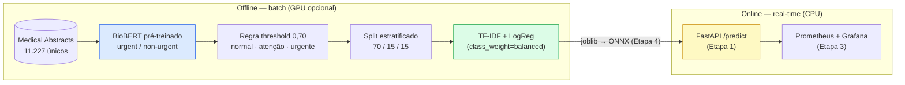

# Medical Triage MLOps — Triagem de Laudos Médicos


Sistema **MLOps de triagem automática de laudos médicos**: dado o texto de um
laudo/abstract, o modelo classifica em **3 níveis de urgência** — `urgente`,
`atenção`, `normal` — para priorizar a fila de atendimento.

O dataset original ([Medical Abstracts TC Corpus](https://github.com/sebischair/Medical-Abstracts-TC-Corpus))
tem categorias de doenças, não urgência. A solução: um **BioBERT pré-treinado**
(`Yuvrajxms09/biobert-triage-classifier`, binário urgent/non-urgent) gera
**pseudo-rótulos** para 11.227 abstracts únicos, uma regra de threshold cria a
zona de incerteza `atenção`, e um **modelo leve TF-IDF + Logistic Regression**
é destilado desses rótulos — é ele que vai para produção (0,3 MB, ~0,5 ms de
latência, sem torch/GPU no serving).

> Projeto do **Tech Challenge Fase 3 — POSTECH (MLET)**. Contexto-mestre e
> registro de decisões em [PLANNING.md](PLANNING.md).

---

## Resultados

Avaliação no split de teste (1.685 amostras, 203 `urgente`). O baseline v1 foi
treinado sobre uma amostra parcial e enviesada (720 abstracts); os modelos v2
usam o corpus completo pseudo-rotulado.

| Modelo | Accuracy | Balanced Acc | Macro F1 | Recall `urgente` | Tamanho | Latência média |
|---|---|---|---|---|---|---|
| MLP v1 (720 amostras) | 0,565 | 0,442 | 0,406 | 0,000 | 7,5 MB | 4,3 ms |
| MLP v2 (corpus completo) | **0,776** | 0,731 | **0,748** | 0,591 | 7,5 MB | 0,59 ms |
| **LogReg balanced v2** ✅ | 0,767 | **0,777** | **0,748** | **0,808** | **0,3 MB** | **0,46 ms** |

**Modelo escolhido para a API: `logreg_tfidf_v2`** — macro F1 empatado com o
MLP, mas encontra 81% dos casos urgentes (a classe crítica de uma triagem),
com `class_weight='balanced'`. Métricas completas (por classe, matriz de
confusão, validação e teste): [docs/results/triage_metrics_v2.json](docs/results/triage_metrics_v2.json).

---

## Arquitetura



A classe `atenção` **não** é aprendida pelo BioBERT — é uma regra operacional
sobre a zona de incerteza do classificador binário
(`0,30 ≤ urgent_score < 0,70`), decisão documentada nos notebooks 02–03 e no
[PLANNING.md](PLANNING.md).

---

## Pré-requisitos

- **[uv](https://docs.astral.sh/uv/getting-started/installation/)** — único
  pré-requisito; resolve as versões exatas do `uv.lock`.

```bash
# macOS/Linux
curl -sSf https://astral.sh/uv/install.sh | sh
# Windows
powershell -c "irm https://astral.sh/uv/install.ps1 | iex"
```

- **GPU (opcional)** — acelera apenas a pseudo-rotulagem (BioBERT): ~2 min em
  GPU vs ~8 h em CPU. O lock trava a build CPU do torch (portável); para usar
  CUDA localmente:

```bash
uv pip install --reinstall torch --index-url https://download.pytorch.org/whl/cu128
# A partir daí use sempre `uv run --no-sync` — um `uv sync` reverte para CPU.
```

---

## Dados e artefatos

- `data/raw/` está **no git** (dataset original, ~17 MB).
- `data/processed/` e `models/*.joblib` estão **fora do git** (`.gitignore`) —
  são regenerados pelo pipeline abaixo, de forma determinística (seed 42).
- `docs/results/*.json` (métricas) ficam no git como referência.

> **Para quem vai desenvolver a API:** o artefato `models/logreg_tfidf_v2.joblib`
> é gerado pelos 3 comandos do quickstart. Sem GPU, peça o arquivo ao time
> (0,3 MB) ou rode a pseudo-rotulagem com `--limit` para um ciclo reduzido.
> O serving **não precisa de torch nem GPU** — só `scikit-learn` + `joblib`.

---

## Quickstart

```bash
# 1. Clonar e instalar
git clone https://github.com/fabii2607/medical-triage-mlops.git
cd medical-triage-mlops
uv sync

# 2. Pipeline completo (determinístico, seed 42)
uv run python -m src.labeling.pseudolabel      # BioBERT → pseudo-rótulos (GPU ~2 min)
uv run python -m src.data.split                # splits 70/15/15 estratificados
uv run python -m src.training.train_mlp --version v2   # MLP + LogReg (~15 s, CPU)

# 3. Qualidade
uv run pytest              # 12 testes
uv run ruff check src tests

# Opções úteis da pseudo-rotulagem:
#   --limit 200   smoke test (não sobrescreve o dataset completo)
#   --resume      retoma do checkpoint (grava a cada 500 textos)
```

> Com a GPU habilitada (ver Pré-requisitos), troque `uv run` por
> `uv run --no-sync` em todos os comandos.

---

## Usando o modelo (contrato para a API)

```python
import joblib

model = joblib.load("models/logreg_tfidf_v2.joblib")   # Pipeline sklearn completo

texto = ["Patient presenting acute myocardial infarction with severe chest pain."]
model.predict(texto)          # ['urgente']
model.predict_proba(texto)    # [[0.070, 0.006, 0.924]]
model.classes_                # ['atenção', 'normal', 'urgente']
```

Entrada: texto livre em inglês (abstract/laudo). Saída: uma das 3 classes +
probabilidades. O pipeline embute o TF-IDF — não há pré-processamento externo.

---

## Estrutura do projeto

```
medical-triage-mlops/
├── src/
│   ├── config.py            # Caminhos e constantes (threshold, seed, max_length)
│   ├── labeling/            # BioBERT (inferência) + regra de triagem + CLI pseudo-rotulagem
│   ├── data/                # CLI do split estratificado com verificação de vazamento
│   ├── training/            # CLI de treino: MLP + LogReg, artefatos versionados
│   └── evaluation/          # Métricas (accuracy, macro P/R/F1, confusão) + latência
├── notebooks/               # História do projeto: 01 EDA · 02 piloto BioBERT ·
│                            # 03 regra de triagem · 04 pseudo-rotulagem ·
│                            # 05 split · 06 treino MLP
├── data/raw/                # Dataset original (no git)
├── data/processed/          # Pseudo-rótulos + splits (fora do git, regenerável)
├── models/                  # Artefatos .joblib (fora do git, regenerável)
├── docs/results/            # Métricas de referência por versão (no git)
├── tests/                   # pytest: regra de triagem, split, métricas
├── api/                     # (Etapa 1) FastAPI: /predict, /health, /metrics
├── dags/                    # (Etapa 2) DAG Airflow
├── monitoring/              # (Etapa 3) Prometheus + Grafana
├── PLANNING.md              # Contexto-mestre: decisões, etapas, riscos
├── pyproject.toml           # Deps prod/dev (uv) + config pytest
└── uv.lock                  # Reprodutibilidade exata
```

---

## Tecnologias

| Categoria | Stack |
|---|---|
| Pseudo-rotulagem | BioBERT via 🤗 transformers + torch (GPU opcional) |
| Modelo de produção | scikit-learn (TF-IDF + LogisticRegression), joblib |
| API (roadmap) | FastAPI + Uvicorn + Pydantic, otimização com ONNX Runtime |
| Orquestração (roadmap) | Airflow standalone em Docker Compose |
| Monitoramento (roadmap) | prometheus-client + Prometheus + Grafana |
| Qualidade | ruff · pytest · type hints |
| Ambiente | uv + `uv.lock` (Python 3.11) |

---

## Documentação

| Documento | Descrição |
|---|---|
| [PLANNING.md](PLANNING.md) | Contexto-mestre: decisões técnicas, arquitetura, etapas e riscos |
| [Resumo dos notebooks](docs/resumo_notebooks_refatoracao.md) | O que cada notebook faz + correções da auditoria |
| [Métricas v2](docs/results/triage_metrics_v2.json) | Métricas completas dos modelos treinados no corpus completo |

---

## Roadmap (etapas do PLANNING)

**Etapa 0 — Estudo em notebooks** ✅
- [x] EDA, piloto BioBERT, regra de triagem, pseudo-rotulagem, split, MLP baseline

**Etapa 0.5 — Refatoração + rodada completa** ✅
- [x] Lógica migrada para `src/` com CLIs reproduzíveis
- [x] Corpus completo pseudo-rotulado (11.227, sem viés, `max_length=512`)
- [x] LogReg balanced v2 escolhido (recall urgente 0,81)
- [x] 12 testes unitários

**Etapa 1 — API**
- [ ] FastAPI: `POST /predict`, `GET /health` + Dockerfile
- [ ] Análise arquitetural AWS (real-time vs batch)

**Etapa 2 — CI/CD e orquestração**
- [ ] GitHub Actions: ruff → pytest → docker build
- [ ] DAG Airflow: pseudolabel → split → train → evaluate → export_onnx

**Etapa 3 — Monitoramento**
- [ ] Prometheus + Grafana (≥3 painéis) + guard-rail da classe `urgente`

**Etapa 4 — Otimização e entrega**
- [ ] Exportação ONNX + benchmark de latência
- [ ] Vídeo STAR (≤5 min)

---

## Licença

[MIT](LICENSE) — POSTECH Tech Challenge Fase 3 (MLET).
